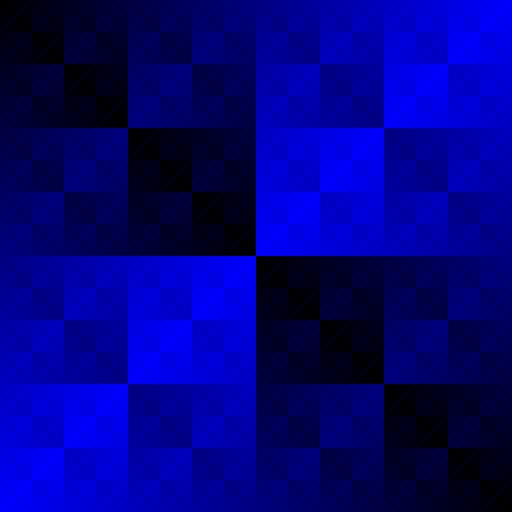

# FractalMaker
#### An Java project I created by accident that happens to be really cool, so I'm making it open source.

*** Author:   *** Aaron Carson  
*** Language: *** Java  

-------------------------------------------------------------------------------------

##Description
Do cool things with fractals!  Play with pixel data with a single Java source file.  It's really easy: the pixel data is stored as a 1-dimensional integer array.  So, most of the pixel data is edited like this:

    public void drawBlueSquareFractal() {
		for (int x = 0; x < image.getWidth(); x++) {
			for (int y = 0; y < image.getHeight(); y++) {
				pixels[x + y * getWidth()] = (x ^ y) / 2;
			}
		}
	}

***for (int x = 0; x < image.getWidth(); x++) {
	for (int y = 0; y < image.getHeight(); y++) {
		pixels[x + y * getWidth()] = (x ^ y) / 2;
	}
}***

This this double for-loop walks through each pixel, and draws the image above.  I have written a number of methods which make cool images like this, that can be called in the method `render(Graphics2D g)`.  Try commenting different methods out to get fun results! (only the last called method will run):

	public void render(Graphics2D g) {
		// ***********************************
		// First, edit the image's pixel data. (try any methods below)
		// ***********************************
		
		// drawRandomNoise();
		// drawHorizontalNoiseBands();
		// drawStripes();
		// drawSquareFractal(2);
		// drawBitShiftedSquareFractal(722);
		drawBlueSquareFractal();	       // comment this out and try something else!
		// drawGreenSquareFractal();
		// drawRedSquareFractal();
		// drawQuadraticFractal();
		// drawTriangleFractal();
		// drawFadingTriangleFractal();
		
		// ***************************************************
		// Second, draw the edited image on the FractalMaker.
		// ***************************************************
		g.drawImage(image, null, null);
		
		// alternatively, use other methods like this to draw content
		// g.setColor(Color.BLACK);
		// g.fillRect(0, 0, getWidth(), getHeight());
	}

Have fun with my code.  Feel free to share with me what you know, or can do with this.